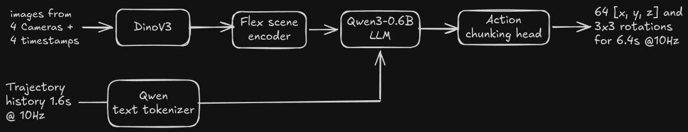

# Dino-Flex-Qwen aka DFQ VLA

DFQ is a ~1B parameter VLA that processes multi-camera, multi-timestamp images and acts as a policy for autonomous driving. It is
built using [NVIDIA's PhysicalAI-Autonomous-Vehicles dataset](https://huggingface.co/datasets/nvidia/PhysicalAI-Autonomous-Vehicles) 

## Model Architecture

Key components of DFQ VLA are:

* [DinoV3](https://huggingface.co/facebook/dinov3-vitb16-pretrain-lvd1689m) as vision encoder: Processes 16 images to output roughly 10k tokens
* [Flex scene encoder](https://jiawei-yang.github.io/Flex/) encoder vision tokens into 900 scene tokens using joint self attention
* [Qwen3-06.B LLM](https://huggingface.co/Qwen/Qwen3-0.6B) consumes vision tokens + trajectory history to produce 8 Meta actions 
* Action chunking head consumes these meta actions + last hidden state of LLM to produce refined 64 xyz + 3x3 rotations

## Current Status and ToDos:

- [ ] SFT: in progress
- [ ] Behaviour tuning: ToDo
- [ ] Integration with AlpaSim: ToDo
- [ ] Checkpoints available on Hub: ToDo